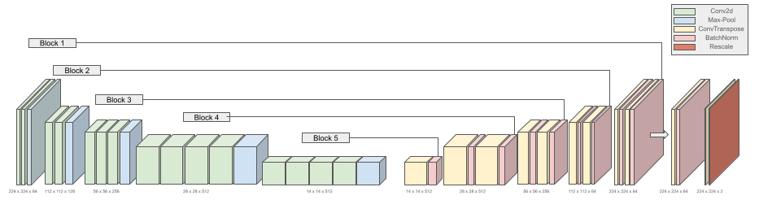

<h1>
ColorAI
  </a>
</h1>

## Model Summary

We implemented a convolutional neural network (CNN) to colorize grayscale images using a U-Net architecture with the VGG-19 model. U-Net is a popular deep learning architecture known for its effectiveness in image segmentation tasks. VGG-19 is a large model with almost 150 million parameters that is pre-trained. It is traditionally used for feature detection and was adapted for colorizing in our project. Our model is trained using the MIT Places365 dataset, which contains 365,000 images of scenes (which we split into 328,500 train and 36,500 test images, a 90/10 split). Moreover, the model makes use of a custom Perceptual Loss function for a higher level chromatic evaluation of the CNN. Our results show that the model produces vibrant and realistically colored images. This project reinforces the potential of deep learning in creative image processing. Below is our VGG-19 U-Net architecture.

## Example Results

The results of perceptual loss showed our model and architecture is viable for creating naturally looking colorful photos, but doesn't correctly account for unique coloring and saturation. Colors returned are plausible and look natural to the human eye. The model can be used to color any grayscale image, but has best use-cases for naturally existing photos, such as old black and white photography or night vision goggles. Below are some example results from our model test dataset. The first image is the L channel, the second image is the truth coloring, and the third image is the predicted coloring.

Quick Start
- Model: place your model at `ml/models/model.h5`
- Start everything:
  - `bash go.sh`
- Use the app: `http://localhost:3000`

What’s Inside
- `server/local_server.py`: Flask API for upload → colorize → fetch
- `client/`: React UI
- `ml/`: model code, virtualenv setup (`ml/setup.sh`), and utilities
- `output/`: colorized images saved here as `local_*.png`

Requirements
- Python 3.9+ and pip
- Node.js 18+ and npm (for the React client)
- Model file at `ml/models/model.h5`

Manual Run (if not using the script)
- Python environment + model
  - `cd ml && ./setup.sh`
  - Put the model at `ml/models/model.h5`
- Start Flask API
  - `python3 server/local_server.py`
- Start React client
  - `cd client && npm install && npm start`

API Endpoints (Flask)
- `GET  /api`                          → health check
- `POST /api/user/create`              → create local dev user (no auth)
- `GET  /api/user/balance/:key`        → get dev balance (mocked)
- `POST /api/image/colorize/:key`      → multipart form `image=@path/to/file.jpg`
- `GET  /api/image/get/:id`            → returns `{ colored: { data: [...] } }`
- `GET  /api/image/list`               → list of image IDs
- `GET  /api/image/total`              → total count (in-memory)

Notes
- No database — the server stores colorized images under `output/` and tracks them in memory while running.
- The React app points to `http://localhost:4000/api` (set in `client/.env.local`).
- Do not run any Node server on port 4000; that’s reserved for Flask in this setup.

